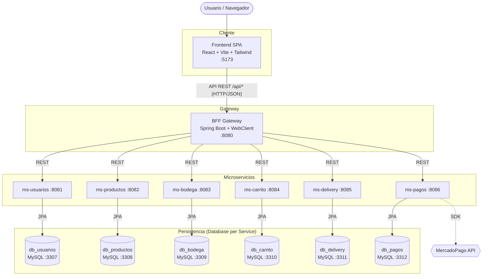

# Diagrama de Arquitectura de Microservicios

**Proyecto:** Tienda Retail Lumina
**Asignatura:** Desarrollo FullStack III (DSY1106)

---

## 1. Diagrama general (Mermaid)

> Este diagrama se renderiza automaticamente en GitHub.



## 2. Diagrama ASCII (alternativo)

```
                    +-------------+
                    |  Frontend   |  React + Vite + Tailwind
                    |   :5173     |
                    +------+------+
                           | API REST (HTTP/JSON)
                    +------v------+
                    | BFF Gateway |  Spring Boot :8080
                    +------+------+
        +-------+-------+--+----+-------+-------+
        |       |       |       |       |       |
   +----v-+ +--v---+ +-v--+ +--v-+ +---v-+ +--v-+
   |Users | |Prods | |Bod.| |Cart| |Deliv| |Pago|
   |:8081 | |:8082 | |:8083| |:8084| |:8085| |:8086|
   +--+---+ +--+---+ +-+--+ +-+--+ +--+--+ +-+--+
      |        |       |      |       |      |
   +--v--+ +--v--+ +--v-+ +--v-+ +--v-+ +--v-+
   |MySQL| |MySQL| |MySQL| |MySQL| |MySQL| |MySQL|
   |:3307| |:3308| |:3309| |:3310| |:3311| |:3312|
   +-----+ +-----+ +----+ +----+ +----+ +----+
```

## 3. Componentes

| Capa | Componente | Tecnologia | Responsabilidad |
|------|-----------|-----------|-----------------|
| Frontend | SPA | React, Vite, Tailwind | Interfaz de usuario |
| Gateway | BFF | Spring Boot, WebClient | Punto unico de entrada, enrutamiento |
| Backend | 6 microservicios | Java 17, Spring Boot 3.2, JPA | Logica de dominio |
| Datos | 6 MySQL 8.0 | Database per Service | Persistencia aislada |
| Externo | MercadoPago | SDK Java | Procesamiento de pagos |

## 4. Patrones de arquitectura aplicados

- **Microservicios**: dominios desacoplados, despliegue y escalado independiente.
- **BFF (Backend For Frontend)**: una unica puerta de entrada para el frontend,
  que oculta la topologia interna y centraliza CORS y enrutamiento.
- **API Gateway / Proxy**: el BFF redirige cada peticion `/api/*` al microservicio
  correspondiente.
- **Database per Service**: cada servicio posee su propia base de datos.
- **API REST**: comunicacion sincrona HTTP/JSON entre capas.

## 5. Flujo de integracion (ejemplo: compra)

1. El usuario navega el catalogo -> `Frontend` consulta `GET /api/productos` al BFF.
2. El BFF redirige a `ms-productos`, que lee de `db_productos` via JPA.
3. El usuario agrega productos -> `POST /api/carrito/{id}/agregar` -> `ms-carrito`.
4. Al pagar -> `POST /api/pagos/crear-preferencia` -> `ms-pagos` -> MercadoPago.
5. `ms-bodega` descuenta stock y `ms-delivery` genera el seguimiento de la entrega.
